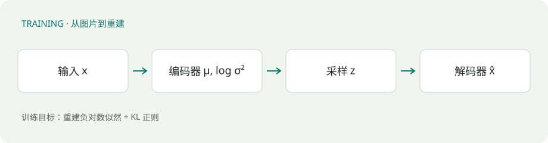
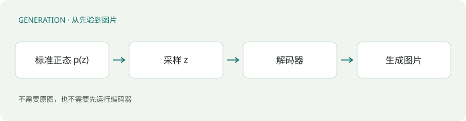

{
  "title": "从 AE 到 VAE：让潜变量成为一个分布",
  "description": "从一张 28×28 的手写数字出发，理解编码器、重参数化与 KL 损失，串起 VAE 的训练和生成。",
  "date": "2026-10-08T16:00:00+08:00",
  "lastmod": "2026-10-08T18:00:20+08:00",
  "slug": "ae-to-vae",
  "categories": [
    "基础"
  ],
  "tags": [
    "VAE",
    "生成模型"
  ],
  "draft": false,
  "math": true,
  "summary": "从一张手写数字出发，逐步理解高斯潜变量、重参数化与 KL 损失。附训练与生成示意图、关键公式和张量维度表。",
  "archiveOrder": 1
}

> 学习范围：这篇笔记只整理从 AE 到 VAE 已经讲过的计算过程与直觉，重点是编码器输出什么、如何采样，以及训练和生成有什么区别。

## 01 · 从重建一张图片开始

普通自编码器（Autoencoder，AE）包含两个神经网络：编码器把输入变成潜变量，解码器根据潜变量重建输入。

以一张 \(28\times28\) 的灰度手写数字为例，展平后得到 \(784\) 个数。把原图记为 \(x\)，我们选择用一个 \(16\) 维向量 \(z\) 表示它，再让解码器还原出 \(784\) 个数，得到重建图 \(\hat{x}\)：

$$
x\in\mathbb{R}^{784}
\xrightarrow{\text{编码器}}
z\in\mathbb{R}^{16}
\xrightarrow{\text{解码器}}
\hat{x}\in\mathbb{R}^{784}.
$$

训练时比较 \(x\) 与 \(\hat{x}\)，让重建图尽量接近原图。这里的 \(16\) 维是我们选择的潜变量维度。

**重建好，不等于随机生成也好。** 重建时，AE 的解码器接收到的是编码器根据图片算出的 \(z\)。如果随便抽一个 \(16\) 维向量，解码器可能没见过类似的输入，输出就未必像一张合理的图片。

## 02 · 编码器输出一个分布

VAE 在这里做了一个改变：编码器不直接给出唯一的 \(z\)，而是给出高斯分布的均值 \(\mu\) 和标准差 \(\sigma\)，再从这个分布中采样得到 \(z\)。

沿用 \(16\) 维潜变量的例子，\(\mu\) 和 \(\sigma\) 各有 \(16\) 个数：\(\mu_j\) 表示第 \(j\) 维的中心，\(\sigma_j\) 表示这一维的波动大小。它们不是整张图片共用的两个标量。

把这个由输入 \(x\) 决定的分布记为 \(q_{\phi}(z\mid x)\)，可以写成：

$$
q_{\phi}(z\mid x)=\mathcal{N}\!\left(\mu_{\phi}(x),\operatorname{diag}(\sigma_{\phi}^{2}(x))\right).
$$

这里的 \(\phi\) 是编码器参数，\(\sigma^2\) 是方差；\(\operatorname{diag}(\sigma^2)\) 表示把各维的方差放在对角线上。在这个设定中，给定 \(x\) 后，各维分别按自己的均值和标准差采样。

**在这里讨论的模型中，固定模型参数，输入同一张图片，\(\mu\) 和 \(\sigma\) 就相同；重新采样得到的 \(z\) 可以不同。** 编码器决定的是“从哪个分布里抽”，采样决定的是“这次抽到哪个数”。解码器最终接收的仍然是一个具体的 \(16\) 维向量 \(z\)。

## 03 · 重参数化：把采样拆成两步

我们希望保留采样的随机性，也希望重建误差能够传回编码器。做法是先抽取标准正态噪声 \(\epsilon\)，再用 \(\mu\) 和 \(\sigma\) 对它平移、缩放：

$$
\epsilon\sim\mathcal{N}(0,I),\qquad z=\mu+\sigma\odot\epsilon.
$$

\(\odot\) 表示对应位置相乘。对于单独一维，就是 \(z=\mu+\sigma\epsilon\)。这样得到的样本，仍然来自均值为 \(\mu\)、标准差为 \(\sigma\) 的高斯分布。

用一个具体数字来看：如果 \(\mu=2\)、\(\sigma=0.5\)，这次抽到 \(\epsilon=0.4\)，那么 \(z=2+0.5\times0.4=2.2\)。保持这次的 \(\epsilon\) 和 \(\sigma\) 不变，把 \(\mu\) 改成 \(3\)，就得到 \(z=3.2\)，也就是比原来增加了 \(1\)。

重参数化把随机性放进 \(\epsilon\)，而 \(\mu\)、\(\sigma\) 到 \(z\) 的部分是乘法与加法，便于反向传播。下一次计算时可以重新抽取 \(\epsilon\)，所以随机性没有消失。

## 04 · 重建与 KL：两个目标的平衡

有了随机采样，还需要回答：生成新图片时，应该从哪里抽取 \(z\)？VAE 选定一个简单的先验分布 \(p(z)=\mathcal{N}(0,I)\)。这里每一维的均值是 \(0\)、标准差是 \(1\)，\(I\) 是单位矩阵。

编码器给出的 \(q_{\phi}(z\mid x)\) 随输入图片而变，先验 \(p(z)\) 则不依赖具体图片。训练时，我们同时考虑两项损失：

$$
\mathcal{L}=\mathcal{L}_{\mathrm{rec}}+\mathcal{L}_{\mathrm{KL}}.
$$

- 重建损失 \(\mathcal{L}_{\mathrm{rec}}\)：让重建图 \(\hat{x}\) 尽量接近输入 \(x\)，要求潜变量保留图片信息
- KL 损失 \(\mathcal{L}_{\mathrm{KL}}\)：衡量编码器分布与先验的偏离，让 \(q_{\phi}(z\mid x)\) 靠近 \(\mathcal{N}(0,I)\)

对于上面的高斯分布，KL 损失可以写成：

$$
\mathcal{L}_{\mathrm{KL}}=\frac12\sum_{j=1}^{d}
\left(\mu_j^2+\sigma_j^2-1-\log\sigma_j^2\right).
$$

\(d\) 是潜变量维度，在我们的例子里 \(d=16\)。先看单独一维：\(\mu_j^2\) 在 \(\mu_j=0\) 时最小，方差相关的部分在 \(\sigma_j=1\) 时最小。

**如果只优化 KL，最理想的结果就是每一维都输出 \(\mu_j=0\)、\(\sigma_j=1\)。** 这时不同图片都对应同一个标准正态分布，采样的 \(z\) 仍然是随机的，但不再携带区分这些图片的信息，解码器也就无法据此还原各自的原图。

所以还需要重建损失。重建项要求“保留这张图的信息”，KL 项要求“分布别偏离先验太远”，两者一起作用，而不是只把其中一项做到最好。

## 05 · 一次训练的完整路径

假设一次输入 \(32\) 张图片，也就是 batch size 为 \(32\)，潜变量维度仍为 \(16\)：

| 量 | 含义 | 形状 |
| --- | --- | --- |
| \(x\) | 展平的输入图片 | \([32,784]\) |
| \(\mu\)、\(\sigma\) | 每张图片对应的均值与标准差 | \([32,16]\) |
| \(\epsilon\) | 每张图片使用的标准正态噪声 | \([32,16]\) |
| \(z\) | 采样得到的潜变量 | \([32,16]\) |
| \(\hat{x}\) | 解码器输出的重建图片 | \([32,784]\) |

第一维的 \(32\) 表示图片数量，第二维表示每张图片有多少个数。\(\mu\) 的形状是 \([32,16]\)，意味着每张图片都有自己的一组 \(16\) 维均值；\(\sigma\) 也是如此。

训练过程可以顺着这条路径理解：

1. 把 \(x\) 送入编码器，得到 \(\mu\) 和 \(\sigma\)
2. 抽取 \(\epsilon\)，通过 \(z=\mu+\sigma\odot\epsilon\) 得到潜变量
3. 把 \(z\) 送入解码器，得到重建图 \(\hat{x}\)
4. 计算重建损失和 KL 损失，再反向传播、更新模型参数

固定参数时，同一张图对应的 \(\mu\) 和 \(\sigma\) 相同；训练中参数会更新，它们也会随之改变。这与采样造成的随机变化是两回事。

## 06 · 生成时为什么不需要编码器？

生成新图片时没有原图 \(x\)，因此不需要先运行编码器。直接从先验采样 \(z\)，交给已经训练好的解码器即可：

$$
z\sim\mathcal{N}(0,I),\qquad \hat{x}=\operatorname{Decoder}_{\theta}(z).
$$

\(\theta\) 是解码器参数。如果想一次生成 \(32\) 张图，就抽取形状为 \([32,16]\) 的 \(z\)，解码后得到 \([32,784]\) 的结果，再把每行还原成 \(28\times28\) 的图片。

区别在于 \(z\) 的来源：训练时先看图片，从编码器给出的分布里采样；生成时没有输入图片，直接从 \(\mathcal{N}(0,I)\) 采样。训练中的 KL 约束，正是为了让这两种来源衔接起来。

## 07 · 小结与自检

先记住这条主线：从 AE 的一个潜向量 \(z\)，走到 VAE 的一组分布参数 \(\mu\)、\(\sigma\)，再采样出一个具体的 \(z\) 给解码器。

1. 固定模型与输入，\(\mu\) 和 \(\sigma\) 相同，采样的 \(z\) 可以不同
2. 重参数化用 \(z=\mu+\sigma\odot\epsilon\) 保留随机性，也让误差能传回编码器
3. 重建项保留图片信息，KL 项让编码器分布靠近先验，两者需要平衡
4. 训练需要编码器和解码器；生成新图可以直接采样 \(z\)，再运行解码器

自检：如果只保留 KL，编码器最容易输出什么？如果一次输入 \(32\) 张图，为什么 \(\mu\) 不是只有 \(16\) 个数？生成时，\(z\) 又是从哪里来的？

## 参考资料

- Kingma, D. P. & Welling, M. [Auto-Encoding Variational Bayes](https://arxiv.org/abs/1312.6114). VAE 与重参数化的原始论文。
